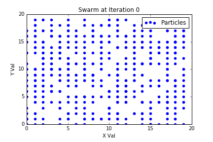
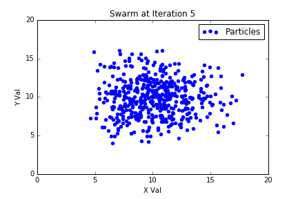
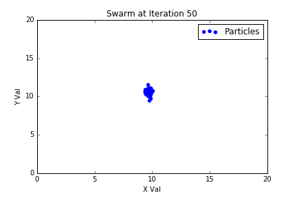
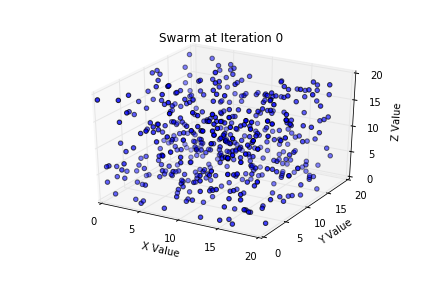
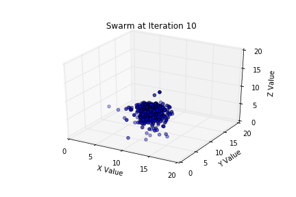
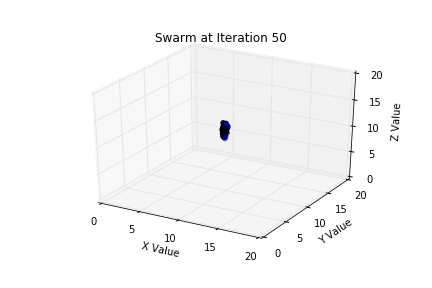
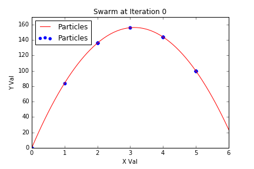
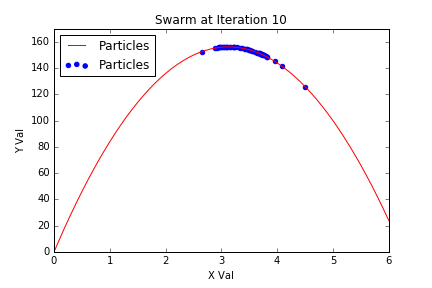
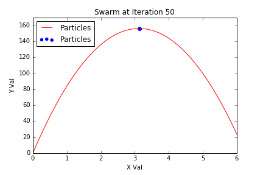

# Particle Swarm Optimization in Python
This is Python code that shows simple examples of particles converging on points to solve optimization problems. 

## Installing  
This application was written in Python 3 using the Anaconda Suite.  
To install Anaconda visit: https://www.continuum.io/downloads  

## Running the Program
Here are three examples the code was adapted to run. The graphs were created using matplotlib.

### Example 1 Two Dimensional Convergence  
The first example was to show the points converging in two dimensions. Here the fitness function was set to be `Fitness = |10 - Val|`. It caused the points to converge on the point (10,10). 

  
  
 

### Example 2 Three Dimensional Convergence  
The second  example was to show the points converging in three dimensions. Here the fitness function was set to be `Fitness = |10 - Val|`. It caused the points to converge on the point (10,10,10). 

  
  
 

### Example 3 Particles Converging on Particle  Motion Problem 
Jennifer hit a golf ball from the ground and it followed the projectile , where t is the time in seconds, and h is the height of the ball. Find the highest point that her golf ball reached. [[2]](http://www.shelovesmath.com/algebra/intermediate-algebra/quadratic-applications/)  
The solution  to this problem is derived below.
`h(t) = -16t^2 + 100t`   

Take the derivative of H:  
`H(t)' = -32t + 100`  

Find the critical points:  
`0 = -32t + 100`  
`x = (25/6)s = 3.125s`  
`y(3.125) = 156.25ft`  

To solve this problem the fitness of the particles was defined as `Fitness=-16x^2+100x`. This was run with a swarm of 50 particles. The swarm produced the result of (3.13, 156.25). 

  
  
 

## Contributing

Please read [CONTRIBUTING.md](CONTRIBUTING.md) for details on our code of conduct, and the process for submitting pull requests to us.

## Versioning

For the versions available, see the [tags on this repository](https://github.com/tylerburnham42/PythonSimplePSO/tags). 

## Authors

* **Tyler Burnham** - *Initial work* - [tylerburnham42](https://github.com/tylerburnham42)

See also the list of [contributors](https://github.com/tylerburnham42/PythonSimplePSO/contributors) who participated in this project.

## License

This project is licensed under the MIT License - see the [LICENSE.md](LICENSE.md) file for details
